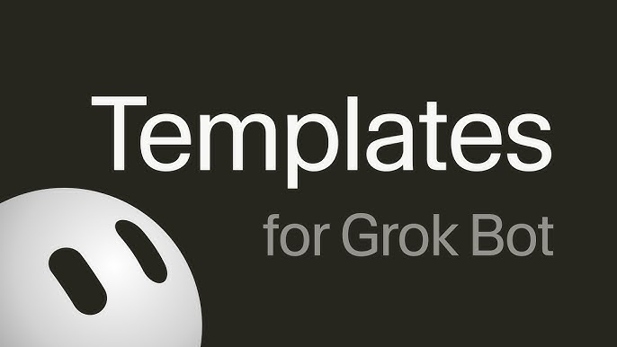

<p align="center">
  
</p>

# Templates for Grok Bot

[](https://github.com/cobusgreyling/grok-bot-templates/actions/workflows/ci.yml)
[](LICENSE)
[](https://cobusgreyling.github.io/grok-bot-templates/)
[](https://cobusgreyling.github.io/grok-bot-templates/)

**Stop pasting vibes. Design the Bot. Get a score.**

Operating contracts for [Grok Bot](https://x.ai/bot) — xAI's durable AI teammate. Spec, Bot Ready score, teams, skills, routines. Paste one URL. Tap a team.

Companion in spirit to [loop-engineering](https://github.com/cobusgreyling/loop-engineering) (inner loops) and [outerloop](https://github.com/cobusgreyling/outerloop) (evidence → verdict). This catalog is the **job → boundary → skill → routine → team** kit for Grok Bot.

> Not affiliated with xAI. Grok Bot is a product of xAI / Cursor. Templates here are contracts you paste into **your** account.

## Install in 60 seconds — no Node

1. In Grok Bot: **New → Create new agent**. Name it **Setup**.
2. Paste this URL and send:

```
https://raw.githubusercontent.com/cobusgreyling/grok-bot-templates/main/START.md
```

3. Tap a team. Try **Eng** (Bug Reproduction + Issue Drafter + PR Reviewer).
4. Connect the plugins it lists. Stay at **L1** for a week — drafts, not sends.

Setup fetches each Bot's `PROFILE.md`. It does not invent prompts.

→ [Pages catalog](https://cobusgreyling.github.io/grok-bot-templates/) (copy PROFILE URL per card) · [Quickstart](./QUICKSTART.md) · [What do you want to do?](./docs/jobs.md)

## Or copy one PROFILE

Paste the raw `PROFILE.md` into **Bot actions → Edit Profile**. Connect the plugins it names. Send the first task. Do not enable a routine until two runs look right.

| Bot | Why | Raw PROFILE |
|-----|-----|-------------|
| [PR Reviewer](templates/engineering/pr-reviewer/) | Review starts at the scary diff | [PROFILE.md](https://raw.githubusercontent.com/cobusgreyling/grok-bot-templates/main/templates/engineering/pr-reviewer/PROFILE.md) |
| [Bug Reproduction](templates/engineering/bug-reproduction/) | Staging repro packs — never production data | [PROFILE.md](https://raw.githubusercontent.com/cobusgreyling/grok-bot-templates/main/templates/engineering/bug-reproduction/PROFILE.md) |
| [Chief of Staff](templates/ops/chief-of-staff/) | Only items that map to the priority list | [PROFILE.md](https://raw.githubusercontent.com/cobusgreyling/grok-bot-templates/main/templates/ops/chief-of-staff/PROFILE.md) |
| [Inbox Triage](templates/personal/inbox-triage/) | Buckets and drafts — never send | [PROFILE.md](https://raw.githubusercontent.com/cobusgreyling/grok-bot-templates/main/templates/personal/inbox-triage/PROFILE.md) |
| [Research Desk](templates/research/research-desk/) | Claims, evidence, disagreements, not-found | [PROFILE.md](https://raw.githubusercontent.com/cobusgreyling/grok-bot-templates/main/templates/research/research-desk/PROFILE.md) |

Full catalog: **49 templates · 10 teams · 47 skills · 8 routines**. All stable templates score **100/100** Bot Ready.

## CLI (optional)

```bash
npx --yes github:cobusgreyling/grok-bot-templates list
npx --yes github:cobusgreyling/grok-bot-templates init pr-reviewer --print
npx --yes github:cobusgreyling/grok-bot-templates score pr-reviewer --badge
npx --yes github:cobusgreyling/grok-bot-templates init --team eng --out ./eng-bots
```

`npx @cobusgreyling/grokbot` is the scoped name; it publishes on the next npm release. GitHub npx works today.

## Choose a door

| Persona | Start |
|---------|--------|
| **I have Grok Bot open** | Paste [START.md](https://raw.githubusercontent.com/cobusgreyling/grok-bot-templates/main/START.md) |
| **I want a team** | Tap Eng / Ops / Sales in Setup · [teams/](./teams/) |
| **I want to write a Bot** | `npx --yes github:cobusgreyling/grok-bot-templates new my-job --category ops` · [authoring](./docs/authoring.md) |
| **I want to convert one** | [convert/](./convert/) |
| **I want to share one** | [sanitizer](./templates/meta/sanitizer/) · [sharing](./docs/sharing.md) |
| **My Bot should read this catalog** | [docs/agent.md](./docs/agent.md) |

## Autonomy

| Level | Name | Week one |
|-------|------|----------|
| **L0** | Observe | Read, report |
| **L1** | Draft | **Default.** Review-ready artifacts |
| **L2** | Approved action | Named writes after in-chat approval |
| **L3** | Scheduled | Routine + missing-source policy + test run |

→ [docs/autonomy.md](./docs/autonomy.md)

## Bot Ready score

`grokbot score <id>` is 100 points: job, sources, never-list, deliverable, first task, skill, no-data, autonomy, example, routine discipline, share-safe, working style.

**Ready** means ≥ 80. CI fails a stable template under that line.

```bash
npx --yes github:cobusgreyling/grok-bot-templates score --badge --md
# 
```

## The loop in 60 seconds

```
Job → Boundary → Skill → Routine → Team
who   never      how     when      handoff
```

A Bot is a durable teammate with a name, a job, a conversation, and working context. Official docs: [Get started](https://docs.x.ai/grok-bot/get-started) · [Bots](https://docs.x.ai/grok-bot/bots) · [Use cases](https://docs.x.ai/grok-bot/use-cases).

Week one is **L1 Draft** — review-ready artifacts, no send/post/pay/merge/production. Same discipline as loop-engineering's report-only week.

→ [SPEC.md](./SPEC.md) (binding) · [vs alternatives](./docs/vs-alternatives.md)

## CLI essentials

| Command | Purpose |
|---------|---------|
| `start` | Print START.md |
| `list` | Catalog |
| `show <id>` | One contract |
| `init <id> --print` | Paste-ready PROFILE |
| `init --team <id>` | Roster + kickoff |
| `score [--badge]` | Bot Ready, optional SVG / shields.md |
| `validate` / `doctor` | Schema, secrets, drift |
| `catalog` | JSON for other Bots |
| `new` | Scaffold a stub |

## Progressive adoption

| Level | What you get | Docs |
|-------|--------------|------|
| **1 — One Bot** | PROFILE + first task | [anatomy](./docs/anatomy.md) |
| **2 — Skill** | Six official fields | [SPEC](./SPEC.md) |
| **3 — Team** | 2–4 Bots, visible handoffs | [chat docs](https://docs.x.ai/grok-bot/chat-and-collaboration) |
| **4 — Routine** | After two good runs + test run | [skills & routines](https://docs.x.ai/grok-bot/skills-routines-and-automations) |

## Safety

Shared computer. Shared plugins. Share links are public. This catalog is share-safe by construction and scanned in CI.

→ [docs/safety.md](./docs/safety.md) · [SECURITY.md](./SECURITY.md)

## Machine API

Public, no auth. Point a Bot at [docs/agent.md](./docs/agent.md).

| URL | Contents |
|-----|----------|
| https://cobusgreyling.github.io/grok-bot-templates/api/v1/status.json | version, capabilities |
| https://cobusgreyling.github.io/grok-bot-templates/catalog.json | full catalog |
| https://cobusgreyling.github.io/grok-bot-templates/api/v1/teams.json | teams |
| https://cobusgreyling.github.io/grok-bot-templates/llms.txt | short machine summary |

## Status

**v1.1.0** — installer-first distribution: START.md as the hero path, Pages copy buttons, catalog API, Bot Ready badge.

→ [CHANGELOG.md](./CHANGELOG.md) · [ROADMAP.md](./ROADMAP.md) · [Discussions](https://github.com/cobusgreyling/grok-bot-templates/discussions)

## Development

```bash
git clone https://github.com/cobusgreyling/grok-bot-templates.git
cd grok-bot-templates
npm install
npm run ci
```

→ [CONTRIBUTING.md](./CONTRIBUTING.md) · [Good first issues](./docs/good-first-issues.md) · [Code of Conduct](./CODE_OF_CONDUCT.md)

## Sources

- [Grok Bot docs](https://docs.x.ai/grok-bot/get-started)
- [Official use cases](https://docs.x.ai/grok-bot/use-cases)
- [Research notes](./docs/research.md)
- [loop-engineering](https://github.com/cobusgreyling/loop-engineering) (quality bar)

## License

MIT © 2026 Cobus Greyling
